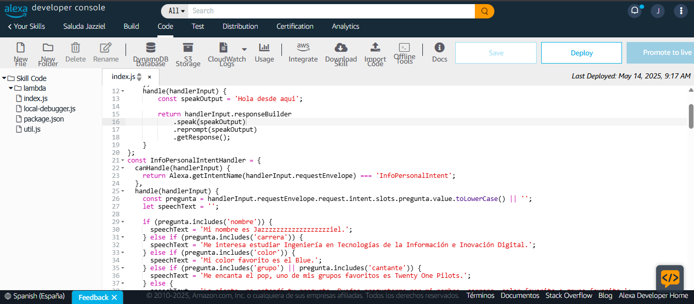
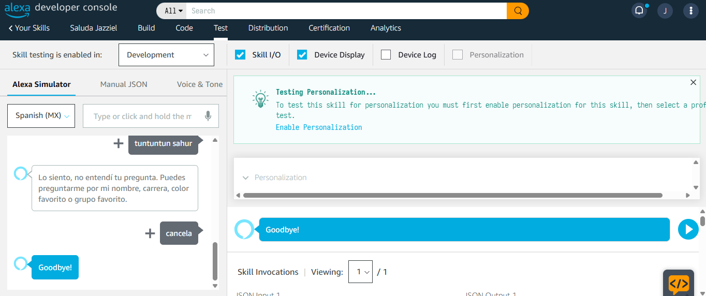

  
  

<h1 align="center">Ingeniería en Desarrollo y Gestión de Software</h1>

  <strong>Universidad Tecnologica de Xicotepec de Juárez Puebla</strong>

Materia: Extraccion de conocimientos de bases de datos   
Docente: Marco Antonio Ramírez Hernandez   
Alumno: Jazziel Rodríguez López  
Matrícula: 220627   

Práctica 02: Esta skill responde a 4 comandos especificos  usando el modelo de interacción de Alexa:

- cual es su color favorito
- dime su cantante favorito
- quiero saber donde estudia
- dime el nombre del creador
 

Fecha entrega: 14 de Mayo de 2025

## Imagenes de la práctica

### Código 

### Testing
